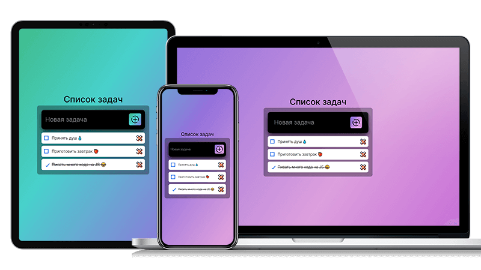

# Проект: "Todo List Native JS"

## Описание

Проект "Todo List Native JS" представляет собой страницу-приложение, в которой реализован список задач на нативном JS без использования дополнительных библиотек, которое сохраняет задачи пользователя даже при перезагрузке страницы, имеет отзывчивый дизайн и плавный интерфейс для мобильных устройств.

## Скриншот

Проект "Todo List Native JS" предоставляет следующий функционал:

1. **Сохранение, удаление и отображение списка задач.**
   - Задачи могут быть легко добавлены, удалены и просмотрены на странице.

2. **Возможность отмечать выполненные задачи.**
   - Пользователь может помечать задачи как выполненные, чтобы отслеживать их статус.

3. **Сохранение задач при перезагрузке страницы.**
   - Используется локальное хранилище для сохранения списка задач после перезагрузки страницы.

4. **Отзывчивый дизайн и плавная анимация.**
   - Реализован отзывчивый дизайн для комфортного использования на мобильных устройствах.
   - Плавная анимация элементов интерфейса для улучшения пользовательского опыта.

5. **Информирование о попытке добавить пустую задачу.**
   - Пользователь получает уведомление в случае попытки добавить задачу с пустым значением.

## Технологии

Проект "Todo List Native JS" разработан с использованием следующих технологий:

- HTML
- CSS
- JS
- БЭМ
- Адаптивная вёрстка mobile-first
- Семантическая вёрстка

## Дополнительная информация

- [Демо проекта](https://spetrosyan94.github.io/todo-list-nativejs/)

## Автор

**Петросян Сергей**

Проект "Что сегодня смотрим" разработан и поддерживается [Петросяном Сергеем](https://github.com/spetrosyan94) - https://github.com/spetrosyan94.

- e-mail: [syspect@bk.ru](mailto:syspect@bk.ru)
- telegram: [@SolidHard1](https://t.me/SolidHard1)
